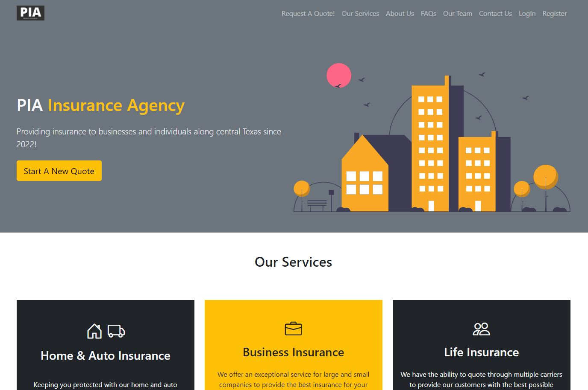

# Project Two - PIA Website

## Requirements

Your project should fulfill the following requirements:

- Use Node.js and Express.js to create a RESTful API.
- Use Handlebars.js as the templating engine.
- Use MySQL and the Sequelize ORM for the database.
- Have both GET and POST routes for retrieving and adding new data.
- Be deployed using Heroku (with data).
- Use at least one new library, package, or technology that we haven’t discussed.
- Have a polished UI.
- Be responsive.
- Be interactive (i.e., accept and respond to user input).
- Have a folder structure that meets the MVC paradigm.
- Include authentication (express-session and cookies).
- Protect API keys and sensitive information with environment variables.
- Have a clean repository that meets quality coding standards (file structure, naming conventions, best practices for class/id naming conventions, indentation, quality comments, etc.).
- Have a quality README (with unique name, description, technologies used, screenshot, and link to deployed application).
- Finally, you must add your project to the portfolio that you created in Module 2.

## Built With:

- Node js
  - Express
    - Express Session
    - Connect Session Sequelize
    - Express Handlebars
  - Sequelize
  - Handlebars
  - dotenv
  - bcrypt
  - Validator
- MySql
- HTML
- CSS
  - Bootstrap

## Contributors:

- John Pacini
- Tirsa Gomez
- Robert Clarady

## App Functionality

### Homepage

The homepage provides basic information about the site including basic insurance information, the team, an FAQ section, contact information, and the ability to login or register. Once a user is logged in, the homepage will provide links to their dashboard and logout functions.

### Dashboard

A user has access to their dashboard after successfully logging in. The dashboard (HAS THIS FUNCTIONALITY)

### Access (Login, Register, Logout)

Policy owners must login to see their policies on the dashboard. After logging in, a cookie is created providing the user access to their dashboard. If a user does not have an account, they can register for a new account and will have access to their dashboard after successfully registering. If logged in, the user will have access to the logout function which will close their session. Once the session is closed the user must login again to see their dashboard. If a user is an admin, their session cookie will provide access to the admin page.

### Admin

Page for admins to review policy owners and make changes as needed. This page currently has basic functions. Additional functions such as updating policies, changing policy owner data, and adding/removing policy owners and admins.

## Deployed Application

[Deployed Website](https://warm-dusk-30815.herokuapp.com)
